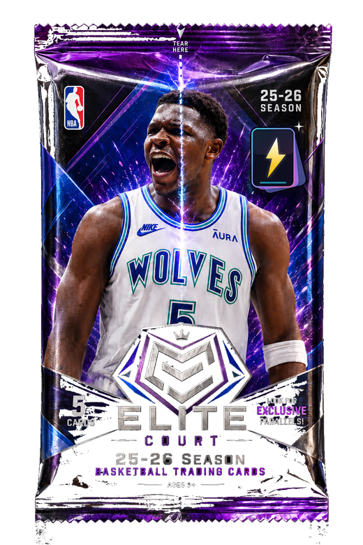

<p align="center">
  
</p>

<p align="center">
  
</p>

<p align="center"><sub>拆包体验预览 · Drag down to tear open the <strong>Elite Court</strong> pack</sub></p>

<h3 align="center">DIY 3D Making Card Studio</h3>

<p align="center">
  <a href="https://cardsbuilder.vercel.app"><strong>在线体验 / Live Demo &rarr;</strong></a>
  &nbsp;·&nbsp;
  <a href="https://jethro5977.github.io/Jethro-s-space/"><strong>GitHub Pages 静态版 &rarr;</strong></a>
</p>

<p align="center">
  
  
  
</p>

<p align="center">
  <a href="#中文">简体中文</a> | <a href="#english">English</a>
</p>

---

## 中文

一个零依赖的纯 Web DIY 3D 球星卡制作器，支持实时 Three.js WebGL 预览、卡面特效、亚克力卡壳渲染，以及本地 / 共享卡牌库。

### 功能

- **卡片设计**：6 种原创卡片系列（Prizm、Tactical、Heritage、Mosaic、Select、Optic），8 种动态特效（Diamond、Lightning、Rainbow、Crystal、Holographic、Laser、Flame、Galaxy），Cutout / Full Art 两种照片模式，球队配色、徽章、稀有度与 7 种卡壳类型
- **3D 预览**：基于 Three.js 的 WebGL 渲染，PBR 透明亚克力材质、环境反射、折射与程序化划痕，支持 360° 旋转、自动展示、正反翻面
- **卡牌库**：本地最多收藏 200 张，支持稀有度 / 系列 / 卡壳 / 收藏筛选；一键自动建库生成 25 位 NBA 球星卡（2025-26 赛季数据）；拆包体验含拖拽撕包、翻卡与稀有卡特效
- **共享卡牌库**：无需账号系统，一键发布 DIY 卡牌供任何人浏览，含官方展示卡
- **导出**：高清 PNG 导出（1500×2100 卡面、2400×3200 3D 视角），正反合图，项目 JSON 导入导出（含签名与蒙版数据完整还原）
- **DIY 工具**：手写签名（4 色笔、位置与缩放调整）、自定义闪光蒙版、卡牌对比 PK、20 项收藏成就

### 快速开始

```bash
git clone https://github.com/Jethro5977/Jethro-s-space.git card-builder
cd card-builder
npm install
npm start
```

浏览器打开 **http://127.0.0.1:4174/**。不要直接用 `file://` 打开 `index.html`，浏览器会阻止 Three.js 模块加载。

`npm start` 运行的是零依赖 Node 静态服务器（`server/shared-server.mjs`），内置共享卡牌库 API。局域网内其他设备可通过 `http://<本机IP>:4174/` 访问。

GitHub Pages 会自动从 `main` 部署静态版，保留制卡、3D 预览、拆包和本地收藏；共享卡牌库的发布 / 浏览功能需要 Node 服务，因此仅在本地服务版中可用。

### Vercel 完整版部署

线上完整版使用 Vercel Functions（`api/[...route].js`）和 Vercel Blob 保存共享卡牌。部署后，在 Vercel 项目中创建并连接一个 **Blob Store**；平台会注入 `BLOB_READ_WRITE_TOKEN`，无需把令牌写入仓库。连接完成后访问 `/api/health` 应返回 `{ "status": "ok", "storage": "vercel-blob" }`，首次请求会自动写入官方展示卡。

### 项目结构

```
card-builder/
├── index.html              # 主页面
├── app.js                  # 卡片引擎：渲染、特效、卡库、导出
├── styles.css               # 样式与特效动画
├── three-preview.js        # Three.js 3D 卡壳预览
├── shared-library.js       # 共享卡牌库前端逻辑
├── server/
│   ├── shared-server.mjs   # Node HTTP 服务器 + 共享库 API
│   └── featured-card.json  # 官方展示卡数据
├── assets/                 # Logo、图标、球员图片、签名素材
├── scripts/
│   ├── audit-player-data.mjs   # 校验球员数据与 NBA/ESPN 一致性
│   └── verify-shared.sh        # 共享库 API 冒烟测试
├── data/
│   └── player-registry.json    # NBA 球员数据库
├── docs/                   # 产品需求与设计文档
├── _headers                # Netlify 安全响应头（CSP 等）
└── CHANGELOG.md            # 版本更新记录
```

### 常用命令

| 命令 | 说明 |
|---------|-------------|
| `npm start` | 启动开发服务器（端口 4174） |
| `npm run check` | 语法检查所有 JS 文件 |
| `npm run verify` | 共享库 API 冒烟测试（需先 `npm start`） |
| `npm run audit:players` | 校验球员姓名与头像地址是否与 NBA/ESPN 一致 |

### 技术栈

纯 Web 项目，零运行时依赖。

- **前端**：原生 JS、CSS 自定义属性、Canvas 2D 导出
- **3D**：Three.js（CDN ES Modules）+ PBR 材质
- **服务端**：Node.js 内置 `http` 模块（无 Express，无框架）
- **存储**：localStorage + IndexedDB（图片离线存储）
- **部署**：Vercel（静态前端 + Functions + Blob），GitHub Pages 静态预览

### 数据来源

球员数据以 **2025-26 NBA 常规赛**为统一口径。球员头像优先取自 NBA CDN，失败时回退 ESPN；球队 Logo 同理。所有素材首次加载后会降采样并转为本地 data URL 缓存。

### 开源协议

MIT &copy; 2026 Jethro

---

## English

A zero-dependency, pure-web DIY 3D trading card builder with real-time Three.js WebGL preview, dynamic card effects, PBR acrylic slab rendering, and a local/shared card library.

### Features

- **Card Design** — 6 original card series (Prizm, Tactical, Heritage, Mosaic, Select, Optic) with 8 dynamic effects (Diamond, Lightning, Rainbow, Crystal, Holographic, Laser, Flame, Galaxy). Cutout and Full Art photo modes, team colorways, badges, rarity tiers, and 7 slab/case types.
- **3D Preview** — Three.js WebGL renderer with PBR acrylic slab, environment reflections, iridescence, and procedural scratches. 360° orbit controls, auto-rotate, and front/back flip.
- **Card Library** — Collect up to 200 cards locally, filterable by rarity, series, case type, and favorites. One-click auto-build fills your collection with 25 NBA stars (2025-26 season data). Pack-opening experience with drag-to-tear and rare card reveals.
- **Shared Library** — Publish cards for anyone to browse, no accounts needed, with a featured showcase card.
- **Export** — High-res PNG export (1500×2100 card face, 2400×3200 3D scene), front/back composite, and project JSON import/export with full signature and foil mask data.
- **DIY Tools** — Hand-drawn signatures (4 colors, position/scale controls), custom foil masks, card comparison PK mode, and 20 collection achievements.

### Quick Start

```bash
git clone https://github.com/Jethro5977/Jethro-s-space.git card-builder
cd card-builder
npm install
npm start
```

Open **http://127.0.0.1:4174/** in your browser. Do not open `index.html` via `file://` — Three.js modules require HTTP.

The dev server (`server/shared-server.mjs`) is a zero-dependency Node static server with a shared card library API. Other devices on your LAN can access it at `http://<your-ip>:4174/`.

GitHub Pages deploys the static edition automatically from `main`. It includes card making, 3D preview, pack opening, and local collection; shared-library browsing and publishing require the Node server or the Vercel Functions deployment.

### Full Vercel deployment

The full online edition uses Vercel Functions (`api/[...route].js`) with Vercel Blob for durable shared-card storage. Create and connect a **Blob Store** in the Vercel project; Vercel injects `BLOB_READ_WRITE_TOKEN`, so no token belongs in this repository. When connected, `/api/health` returns `{ "status": "ok", "storage": "vercel-blob" }` and the first request seeds the featured card automatically.

### Project Structure

```
card-builder/
├── index.html              # Main page
├── app.js                  # Card engine: rendering, effects, library, export
├── styles.css               # All styles and effect animations
├── three-preview.js        # Three.js 3D slab preview
├── shared-library.js       # Shared library frontend logic
├── server/
│   ├── shared-server.mjs   # Node HTTP server + shared library API
│   └── featured-card.json  # Featured showcase card data
├── assets/                 # Logos, icons, player images, signatures
├── scripts/
│   ├── audit-player-data.mjs   # Verify player data against NBA/ESPN
│   └── verify-shared.sh        # Shared library API smoke test
├── data/
│   └── player-registry.json    # NBA player database
├── docs/                   # Product specs and design docs
├── _headers                # Netlify security headers (CSP, etc.)
└── CHANGELOG.md            # Version history
```

### Scripts

| Command | Description |
|---------|-------------|
| `npm start` | Start the dev server on port 4174 |
| `npm run check` | Syntax-check all JS files |
| `npm run verify` | Smoke-test the shared library API (server must be running) |
| `npm run audit:players` | Verify player names and headshot URLs against NBA/ESPN |

### Tech Stack

Pure web — zero runtime dependencies.

- **Frontend**: Vanilla JS, CSS custom properties, Canvas 2D export
- **3D**: Three.js (ES modules via CDN) with PBR materials
- **Server**: Node.js built-in `http` module (no Express, no frameworks)
- **Storage**: localStorage + IndexedDB for image offloading
- **Hosting**: Vercel (static frontend + Functions + Blob), with GitHub Pages as a static preview

### Data Sources

Player stats are based on the **2025-26 NBA regular season**. Player headshots are fetched from the NBA CDN with ESPN fallback. Team logos use NBA primary with ESPN fallback. All assets are downsampled and stored locally as data URLs after first load.

### License

MIT &copy; 2026 Jethro

---

<p align="center">Developed by <strong>Jethro</strong> · Built with <a href="https://claude.ai">Claude</a></p>
