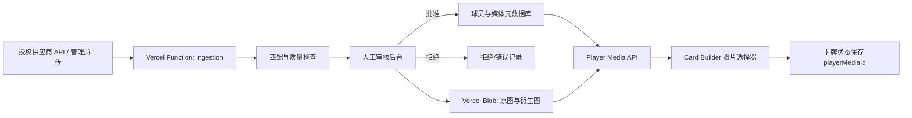

# PRD — NBA 现役球员影像资产库与卡牌照片替换

| 项目 | 内容 |
| --- | --- |
| 产品 | Card Builder — DIY 3D Making Card Studio |
| 文档版本 | v1.1 |
| 日期 | 2026-08-09 |
| 状态 | Phase 0 / Phase 1 工程基础已实施；授权图片源与人工身份复核待完成 |
| 目标用户 | 卡牌创作者、内容管理员、影像审核人员 |
| 核心目标 | 用经过授权且准确配对的比赛、训练、纪念与里程碑照片，逐步替换单一 NBA/ESPN 官方头像 |

---

> **2026-08-09 实施更新：** 已落地 25 人稳定 ID 注册表、媒体元数据与授权闸门、Vercel Blob 管线、WebP 衍生图、管理员上传/撤回审计 API、前端照片选择器、`playerMediaId` 状态迁移及头像安全回退。由于尚未提供 Sportradar/Getty 或其他供应商许可证和凭证，未导入或抓取任何未经授权的比赛/训练/纪念照片。当前 25 人身份记录均保留为 `needs_review`，不得视为已完成官方人工复核。运行与接入说明见 `docs/PLAYER_MEDIA_RUNBOOK.md`。

---

## 1. 背景

Card Builder 当前内置 25 名种子球员。球员数据保存在 `app.js` 的 `NBA_PLAYER_ROWS` 中，并以：

1. `nbaId` 请求 NBA CDN 官方头像；
2. 请求失败时以 `espnId` 回退 ESPN 头像；
3. 图片加载后转换为 Data URL，写入卡牌状态或本地卡牌库。

这一方案能快速生成卡牌，但存在以下问题：

- 所有球员主要使用标准头像，卡面缺少比赛叙事与收藏价值；
- 图片与球员资料、球队、赛季和特定事件之间没有结构化关联；
- 转会后容易出现“当前资料 + 旧球队球衣照片”的语义冲突；
- 无法区分比赛、训练、媒体日、纪念和破纪录等照片类型；
- 当前 `data/player-registry.json` 仅覆盖部分球员，且与 `NBA_PLAYER_ROWS` 存在字段不一致风险；
- 缺少来源、摄影师、授权范围、授权到期日和下架记录，不适合直接扩展成公开影像库。

本项目需要建设一套可审核、可追溯、可渐进替换的 **NBA Player Media Library**，使卡牌编辑器能够按球员和场景选择照片，同时确保人物、球队、时间和授权信息匹配准确。

## 2. 产品目标

### 2.1 核心目标

1. 为每名现役 NBA 球员建立唯一、稳定的球员主记录；
2. 为球员收集并管理比赛场上、训练、媒体日、纪念、庆祝和里程碑照片；
3. 每张照片必须准确关联球员、球队快照、赛季、比赛或事件及授权信息；
4. 在卡牌编辑器中提供可视化照片选择器，逐步替换默认官方头像；
5. 支持新照片批量导入、自动初筛、人工复核、发布、撤回和授权到期下架；
6. 保留 NBA/ESPN 头像作为缺图时的最后回退，不再作为优先视觉素材。

### 2.2 成功指标

| 指标 | P0（25 名种子球员） | 全量阶段 |
| --- | --- | --- |
| 球员资料匹配准确率 | 100% | 100% |
| 已发布照片的人物误配率 | 0 | 0 |
| 非头像照片覆盖率 | 100% | ≥ 95% 现役球员 |
| 每名种子球员可用照片 | ≥ 3 张 | 明星球员 ≥ 8 张，其他球员 ≥ 2 张 |
| 来源与授权字段完整率 | 100% | 100% |
| 图片选择接口 P95 | < 500 ms | < 700 ms |
| 图片首屏加载 | 移动端 < 2.5 s | 移动端 < 2.5 s |

## 3. 关键原则与合规边界

### 3.1 不直接批量抓取 NBA.com 图片用于公开产品

NBA.com 的现行条款说明，照片、图像、比赛画面、球队标识等篮球内容受 NBA 或相关权利方控制，未经书面许可不得复制、修改、重新发布、公开展示或用于商业目的。因此：

- NBA.com 球员页可作为 **名单与个人资料核验来源**；
- NBA CDN 头像只保留为现有兼容回退，是否继续公开使用需单独确认授权；
- 不把 NBA.com、球队官网或社交媒体网页图片作为无许可的自动抓取源；
- 不通过绕过登录、反爬、热链限制或水印的方式取得图片；
- 任何来源不清、仅声明“网络图片”的资产不得进入 `approved` 状态。

### 3.2 推荐图片来源

| 优先级 | 来源 | 用途 | 上线条件 |
| --- | --- | --- | --- |
| P0 | Sportradar Images API / Getty 授权内容 | 球员头像、比赛 Action Shot、事件照片 | 已购买覆盖本产品用途的许可证，并保存 provider asset ID 与授权快照 |
| P0 | 用户或管理员上传的自有/已授权照片 | 训练、纪念、定制卡牌素材 | 上传者确认权利，管理员审核证明文件 |
| P1 | NBA / 球队书面授权的媒体素材 | 官方比赛、训练、媒体日照片 | 保存书面许可、使用范围和到期日 |
| P2 | 其他正规图片社或摄影师直授权 | 特定比赛、里程碑、纪念照片 | 保存合同、摄影师署名与使用限制 |
| 回退 | 当前 NBA/ESPN 头像链路 | 尚未完成影像覆盖的球员 | 仅作为临时兼容方案，单独标记 `fallback` |

Sportradar Images API 提供球员头像和比赛 Action Shot，并通过 Sportradar ID、球员、事件和图片清单进行关联；其 Getty 内容仍受 Getty 授权条款约束，接入 API 不等于自动获得任意用途授权。

### 3.3 发布前的授权闸门（License Gate）

照片只有同时满足以下条件才能发布：

- `license_status = valid`；
- `usage_scope` 包含 Web 展示和用户生成卡牌预览；
- 若允许导出成品，授权还必须包含衍生设计与下载用途；
- 授权未过期，且地域范围覆盖网站服务地区；
- 已保存来源 URL、provider asset ID、摄影师/图片社和授权证明；
- 不含禁止修改、禁止裁切或仅限新闻编辑用途但产品场景不符合的限制。

> 本节是产品与工程控制要求，不替代专业法律意见。上线前应由权利负责人确认最终许可范围。

## 4. 用户与使用场景

### 4.1 卡牌创作者

用户选择球员后，打开“球员照片”区域，可以按“比赛 / 训练 / 里程碑 / 纪念 / 媒体日”筛选。选择一张比赛照片后，卡牌自动加载原图、推荐裁切和照片说明。

### 4.2 内容管理员

管理员通过授权供应商 API 导入一批图片，系统按 provider player ID 自动关联候选球员，并检查球队、赛季、比赛日期和图片质量。管理员逐张确认后发布。

### 4.3 里程碑策划

运营人员为“生涯得分纪录”“总冠军”“MVP”“退役纪念”等事件建立 Moment，关联官方事实来源和一至多张已授权照片。卡牌选择器以事件专题展示。

### 4.4 授权撤回

某张照片授权到期或收到下架请求后，管理员将其设为 `revoked`。新卡牌不再显示该照片；已保存项目加载时自动显示替换提示，并回退至其他已批准照片或头像。

## 5. 范围

### 5.1 本期范围（In Scope）

- 现役球员主数据与多来源 ID 映射；
- 照片元数据、授权信息和审核状态管理；
- 授权图片的 API 导入与管理员上传；
- 比赛、训练、媒体日、庆祝、纪念、里程碑分类；
- 人物与球队/赛季/事件准确配对；
- 原图存储、WebP 衍生图、缩略图与推荐裁切；
- 卡牌编辑器照片选择器；
- 默认照片选择、旧头像回退与无损迁移；
- Vercel Functions API 与 Vercel Blob 存储；
- 审核日志、授权到期和下架机制。

### 5.2 非目标（Out of Scope）

- 在未获得授权前批量下载并公开 NBA.com、ESPN、社交媒体或搜索引擎图片；
- 自动去水印、绕过付费墙或反爬机制；
- 仅凭人脸识别结果自动发布照片；
- 本期内完成全联盟所有历史球员与全部历史比赛照片；
- 重新分发图片供应商的原始素材包；
- 在授权未覆盖时允许用户下载未加限制的高清原图。

## 6. 内容分类体系

### 6.1 一级分类 `category`

| 枚举值 | 中文 | 定义 |
| --- | --- | --- |
| `game_action` | 比赛场上 | 正式比赛中的持球、投篮、扣篮、防守、庆祝等画面 |
| `training` | 训练 | 球队训练、个人训练、热身和训练营 |
| `media_day` | 媒体日 | 定妆、官方媒体日、赛季宣传照 |
| `milestone` | 纪录/里程碑 | 与明确可核验纪录、奖项或生涯节点关联的照片 |
| `commemorative` | 纪念 | 纪念仪式、致敬、退役球衣、特别主题活动 |
| `celebration` | 庆祝 | 夺冠、颁奖、赛后庆祝、关键胜利 |
| `profile` | 肖像 | 非标准证件式的授权人物肖像 |
| `headshot_fallback` | 头像回退 | 当前 NBA/ESPN 标准头像兼容层 |

### 6.2 二级标签 `tags`

示例：`dunk`、`three_pointer`、`layup`、`defense`、`block`、`pass`、`rebound`、`tunnel`、`warmup`、`trophy`、`award`、`record_breaking`、`championship`、`all_star`、`rookie`、`tribute`。

同一照片可有多个标签，但只能有一个一级分类。

## 7. 准确配对规则

### 7.1 球员身份匹配

每名球员使用内部 `player_id` 作为唯一主键，并维护：

- `nba_id`；
- `sportradar_id`；
- `espn_id`；
- 标准英文名、展示名、曾用名与名称别名；
- 当前球队、球衣号码、位置；
- 生效时间范围内的球队履历。

禁止只用姓名字符串作为最终关联键。姓名只用于搜索和人工辅助。

### 7.2 照片自动初筛

系统按以下顺序生成匹配置信度：

1. 供应商图片中的 `player_id` 与已验证 ID 映射一致；
2. 图片事件 ID 能关联到该球员参加的比赛或活动；
3. 拍摄日期落在球员对应球队效力时间范围内；
4. 图片描述中的姓名、球队和球衣号码不存在冲突；
5. 可选的人脸相似度和 OCR 号码只作为辅助信号。

任何硬性冲突都进入 `needs_review`，不得自动发布。

### 7.3 人工复核清单

- 画面主体确为目标球员；
- 多人照片中主体明确，推荐裁切不会切入错误人物；
- 球衣对应 `team_at_capture`，不得误标为当前球队；
- 比赛/事件日期与赛季一致；
- `milestone` 的纪录描述有 NBA、球队或其他权威事实来源；
- 图片来源、摄影师、授权类型和到期日完整；
- 图片清晰、无水印、无明显压缩损坏；
- 图片内容适合生成卡牌，不包含不当或敏感画面。

### 7.4 发布状态

```text
discovered → downloaded → matched → needs_review → approved → published
                                              ↘ rejected
published → expired / revoked / archived
```

只有 `published` 资产可以被普通用户选择。

## 8. 功能需求（Functional Requirements）

### FR-1 球员主数据同步

- FR-1.1 以 NBA 官方 League Roster 作为现役状态和基础资料的核验参考；
- FR-1.2 每日检查名单变化，赛季外至少每周检查一次；
- FR-1.3 转会、签约、裁员不覆盖历史记录，而是结束旧 `team_tenure` 并新增记录；
- FR-1.4 `NBA_PLAYER_ROWS` 与 `data/player-registry.json` 最终迁移为同一数据源生成，禁止双份手工维护；
- FR-1.5 审计脚本必须检查姓名、球队、号码、外部 ID 重复和缺失。

### FR-2 图片采集（Ingestion）

- FR-2.1 支持 Sportradar Images API manifest 按球员、赛季、比赛和类别导入；
- FR-2.2 支持管理员上传 JPG/PNG/WebP，并录入权利证明；
- FR-2.3 所有远程采集只允许白名单域名，禁止任意 URL 服务端抓取；
- FR-2.4 下载时保存原始响应元数据、ETag、SHA-256 和 provider asset ID；
- FR-2.5 相同哈希或相同 provider asset ID 的图片不得重复入库；
- FR-2.6 导入失败可重试，连续失败进入任务错误队列，不影响已发布图片。

### FR-3 图片处理

- FR-3.1 保留授权允许范围内的原始文件；
- FR-3.2 生成卡牌图 `900×1260 WebP`、缩略图 `360×504 WebP`；
- FR-3.3 默认保持人物完整，支持管理员调整焦点和 5:7 推荐裁切；
- FR-3.4 保存主体安全区 `subject_bbox` 与焦点 `focal_point`；
- FR-3.5 禁止放大低清图片冒充高清，长边小于 1200 px 默认不批准为主卡图片；
- FR-3.6 EXIF 中不必要的定位信息在公开衍生图中移除。

### FR-4 审核后台

- FR-4.1 展示原图、裁切预览、候选球员、球队快照、事件和授权状态；
- FR-4.2 支持批准、拒绝、退回修改、发布、撤回；
- FR-4.3 所有操作写入不可覆盖的审核日志；
- FR-4.4 支持按球员、球队、类别、状态、来源和授权到期日筛选；
- FR-4.5 授权 30 天内到期时显示预警。

### FR-5 卡牌编辑器照片选择器

- FR-5.1 用户选择球员后，仅展示该 `player_id` 的 `published` 照片；
- FR-5.2 支持分类 Tab：`推荐 / 比赛 / 训练 / 里程碑 / 纪念 / 肖像`；
- FR-5.3 卡片显示缩略图、日期、球队、事件标题和摄影师/来源；
- FR-5.4 默认优先使用当前球队且适合 5:7 裁切的比赛照片；
- FR-5.5 使用旧球队照片时必须显示球队与拍摄日期，不得伪装为当前赛季素材；
- FR-5.6 用户选择照片后保存 `playerMediaId`，而不是只保存易失效的远程 URL；
- FR-5.7 原有“上传照片 / CUTOUT / FULL ART / 缩放 / 位置”功能保持可用；
- FR-5.8 缺图顺序：已批准比赛照 → 已批准肖像 → 已批准媒体日 → 头像回退 → 本地占位图。

### FR-6 里程碑与纪念事件

- FR-6.1 里程碑必须关联独立 `moment_id`；
- FR-6.2 包含事件名称、日期、赛季、比赛 ID、对手和权威事实来源；
- FR-6.3 破纪录数值不得只依据图片标题推断；
- FR-6.4 同一事件可关联多张照片，但必须逐张审核授权；
- FR-6.5 若事实被更正，可更新 Moment 文案，但保留版本和审计记录。

### FR-7 撤回与回退

- FR-7.1 `expired`、`revoked` 和 `archived` 图片立即从选择列表移除；
- FR-7.2 已保存卡牌仍保留 `playerMediaId` 和历史署名，但重新渲染时提示资源不可用；
- FR-7.3 系统自动寻找同球员同类别替代图，用户确认后替换；
- FR-7.4 提供权利方下架入口，管理员可按 provider asset ID 全局撤回。

## 9. 数据模型

### 9.1 `players`

```json
{
  "player_id": "pl_01...",
  "display_name": "ANTHONY EDWARDS",
  "legal_name": "Anthony Edwards",
  "aliases": ["Ant Edwards"],
  "active": true,
  "current_team": "MIN",
  "jersey_number": "5",
  "position": "SG",
  "nba_id": "1630162",
  "espn_id": "4594268",
  "sportradar_id": "...",
  "verified_at": "2026-08-09T00:00:00Z",
  "source_url": "https://www.nba.com/players"
}
```

### 9.2 `player_team_tenures`

```json
{
  "player_id": "pl_01...",
  "team": "MIN",
  "from": "2020-11-18",
  "to": null,
  "jersey_numbers": ["1", "5"],
  "source_url": "..."
}
```

### 9.3 `media_assets`

```json
{
  "media_id": "pm_01...",
  "player_id": "pl_01...",
  "category": "game_action",
  "tags": ["dunk", "celebration"],
  "captured_at": "2026-01-15T02:30:00Z",
  "season": "2025-26",
  "team_at_capture": "MIN",
  "opponent": "MEM",
  "game_id": "...",
  "moment_id": null,
  "provider": "sportradar_getty",
  "provider_asset_id": "...",
  "source_url": "...",
  "photographer": "...",
  "credit_line": "...",
  "license_status": "valid",
  "license_type": "rights_managed",
  "usage_scope": ["web_display", "card_derivative"],
  "license_expires_at": null,
  "original_blob_path": "player-media/original/pm_01....jpg",
  "card_blob_path": "player-media/card/pm_01....webp",
  "thumb_blob_path": "player-media/thumb/pm_01....webp",
  "sha256": "...",
  "width": 2400,
  "height": 3000,
  "focal_point": { "x": 0.52, "y": 0.36 },
  "subject_bbox": { "x": 0.18, "y": 0.06, "w": 0.66, "h": 0.9 },
  "match_confidence": 0.99,
  "status": "published",
  "reviewed_by": "admin",
  "reviewed_at": "2026-08-09T00:00:00Z"
}
```

### 9.4 `moments`

```json
{
  "moment_id": "mo_01...",
  "player_id": "pl_01...",
  "type": "record",
  "title": "...",
  "description": "...",
  "occurred_at": "2026-01-15T00:00:00Z",
  "game_id": "...",
  "fact_sources": [
    { "publisher": "NBA", "url": "...", "verified_at": "2026-08-09T00:00:00Z" }
  ],
  "status": "verified"
}
```

### 9.5 `media_audit_logs`

记录 `actor`、`action`、`media_id`、变更前后摘要、时间和原因。审核日志只追加，不允许覆盖。

## 10. 存储与系统架构

### 10.1 推荐架构



### 10.2 分阶段存储方案

**阶段 A：P0 25 名球员**

- 复用当前私有 Vercel Blob；
- 元数据按 `player-media/meta/<media_id>.json` 保存；
- 图片按 `player-media/original|card|thumb/` 分层；
- 通过 Vercel Function 读取私有 Blob，不向前端泄露写入 token；
- 建立 `player-media/index/published.json` 作为小规模查询索引。

**阶段 B：全量现役球员**

- 球员、媒体、事件、授权和审核日志迁移至 PostgreSQL；
- Vercel Blob 继续存图片文件；
- 数据库只保存 Blob pathname、元数据和授权记录；
- 公开图片若许可证允许直接交付，可新建 Public Blob Store；现有 Private Store 的访问类型不能事后修改；
- 授权要求私有交付时继续通过 Function 代理，并设置缓存和访问控制。

Vercel Blob 适合保存大文件，但不是面向复杂筛选和关系查询的数据库。全量阶段不应通过逐个列举 Blob JSON 来实现多维搜索。

## 11. API 设计

| 方法 | 路径 | 说明 |
| --- | --- | --- |
| GET | `/api/players?active=true&team=MIN` | 获取球员列表与当前资料 |
| GET | `/api/players/:playerId` | 获取球员详情、外部 ID 和球队履历 |
| GET | `/api/players/:playerId/media?category=game_action&cursor=...` | 获取已发布照片 |
| GET | `/api/player-media/:mediaId` | 获取照片元数据、署名和授权展示字段 |
| GET | `/api/player-media/:mediaId/file?variant=card` | 返回 card/thumb 图片，不直接暴露私有 Blob token |
| GET | `/api/players/:playerId/moments` | 获取已验证里程碑/纪念事件 |
| POST | `/api/admin/player-media/import` | 创建供应商导入任务 |
| POST | `/api/admin/player-media/upload` | 管理员上传授权图片 |
| PATCH | `/api/admin/player-media/:mediaId` | 更新匹配、裁切、分类和授权字段 |
| POST | `/api/admin/player-media/:mediaId/approve` | 审核批准 |
| POST | `/api/admin/player-media/:mediaId/revoke` | 撤回或下架 |

管理员接口必须鉴权；普通浏览接口只返回 `published` 且授权有效的资产。

## 12. 前端改造

### 12.1 球员照片面板

在现有“球员照片”区增加：

- `从影像库选择` 按钮；
- 分类 Tab 和照片网格；
- 照片详情：日期、球队、比赛/事件、来源、摄影师；
- `推荐裁切`、`恢复完整图`；
- 当前照片授权/来源信息入口；
- 缺图或授权撤回提示。

### 12.2 卡牌状态新增字段

```json
{
  "playerId": "pl_01...",
  "playerMediaId": "pm_01...",
  "playerImageCategory": "game_action",
  "playerImageCredit": "...",
  "playerImageCapturedAt": "2026-01-15T02:30:00Z",
  "playerImageTeamAtCapture": "MIN",
  "playerImageLicenseSnapshot": "lic_01..."
}
```

仍保留 `playerImg`，用于用户上传图片和旧项目兼容；新影像库图片优先通过 `playerMediaId` 解析。

## 13. 非功能需求（Non-Functional Requirements）

| 编号 | 需求 |
| --- | --- |
| NFR-1 | 人物误配是 P0 阻断问题；任何已发布误配必须立即下架并追踪原因 |
| NFR-2 | 图片接口支持 ETag、长缓存和 WebP，列表首屏只加载缩略图 |
| NFR-3 | 上传文件需验证 MIME、文件魔数、像素尺寸、文件大小和哈希 |
| NFR-4 | 远程导入仅允许配置白名单域名，防止 SSRF |
| NFR-5 | 原图、授权证明和管理员接口不得公开暴露 |
| NFR-6 | 所有时间保存 UTC；前端按用户时区显示 |
| NFR-7 | API 分页，不一次返回全量球员照片 |
| NFR-8 | 图片撤回后 5 分钟内从所有选择接口和 CDN 缓存失效 |
| NFR-9 | 移动端照片选择器支持触控、懒加载和低带宽占位图 |
| NFR-10 | 保持旧项目 JSON、现有本地库和共享卡牌库兼容 |

## 14. 分阶段实施计划

### Phase 0 — 授权与数据清理

- 确认 Sportradar/Getty 或其他供应商授权范围和成本；
- 决定是否允许用户导出含授权照片的高清卡牌；
- 合并 `NBA_PLAYER_ROWS` 与 `player-registry.json`；
- 修复 25 名种子球员的球队、号码和外部 ID 冲突；
- 建立球员 ID 映射和审核规范。

**退出条件：** 授权来源可用；25 名球员主数据 100% 通过人工复核。

### Phase 1 — 25 名种子球员 MVP

- 每人至少导入 1 张比赛照、1 张训练/媒体日照；
- 有明确里程碑者再增加 1 张里程碑或纪念照；
- 完成 Blob 目录、元数据 JSON、审核 API 和照片选择器；
- 保留现有头像回退。

**退出条件：** 25 人全部拥有至少 3 张可用照片或有书面例外；人物误配为 0。

### Phase 2 — 全量现役名单

- 接入官方名单同步和 PostgreSQL；
- 每名现役球员至少 1 张已批准非头像照片；
- 完成转会、双向合同、伤停和离队状态处理；
- 上线增量同步与到期预警。

**退出条件：** 现役名单覆盖率 ≥ 95%，其余球员有明确缺图状态和头像回退。

### Phase 3 — 事件与专题

- 建立里程碑、纪录、奖项、冠军和纪念 Moment；
- 明星球员扩充至 8 张以上；
- 增加“纪录时刻”“冠军庆祝”“训练场”等专题入口。

### Phase 4 — 自动化运营

- 定时拉取新图片 manifest；
- 自动去重、初筛、候选匹配和质量评分；
- 人工只处理冲突、高价值图片和最终批准；
- 生成覆盖率、授权到期、错误率和待审核报表。

## 15. 验收标准（Acceptance Criteria）

| 编号 | 验收项 |
| --- | --- |
| AC-1 | 25 名种子球员均有稳定内部 `player_id`，且 nba/espn/sportradar ID 不重复 |
| AC-2 | 每张已发布照片均包含球员、拍摄日期、球队快照、来源、摄影师/图片社和授权状态 |
| AC-3 | 随机抽查与全量 P0 人工复核均无人物误配 |
| AC-4 | 转会前旧球队照片会明确显示 `team_at_capture` 和日期 |
| AC-5 | 里程碑照片关联已验证 Moment 和至少一个权威事实来源 |
| AC-6 | 未授权、授权过期、审核未通过的照片无法从普通 API 获取 |
| AC-7 | 卡牌编辑器可按类别筛选、选择、裁切并保存 `playerMediaId` |
| AC-8 | 旧项目仍能加载；缺少 `playerMediaId` 时按原 `playerImg` 渲染 |
| AC-9 | 图片撤回后，选择器不再展示，旧卡牌显示替换提示并提供安全回退 |
| AC-10 | 移动端照片网格流畅，无一次性加载原图或明显布局跳动 |
| AC-11 | 管理员导入任意非白名单 URL 会被拒绝 |
| AC-12 | 同一 provider asset ID 或 SHA-256 图片无法重复入库 |

## 16. 风险与对策

| 风险 | 影响 | 对策 |
| --- | --- | --- |
| 图片授权成本或范围不足 | 无法公开展示/导出 | Phase 0 先确认许可；区分 Web 展示与导出权限 |
| 人物误配 | 严重信任与合规问题 | 外部 ID 关联 + 事件核验 + 人工终审 |
| 转会造成图片语义错误 | 卡牌信息冲突 | 保存 `team_at_capture` 与球队履历，不用当前球队覆盖历史 |
| 纪录描述不准确 | 内容可信度下降 | Moment 独立核验，至少一个权威事实来源 |
| Vercel Blob 查询能力不足 | 全量列表变慢 | P0 JSON 索引；全量阶段迁移 PostgreSQL |
| 私有 Blob 图片代理成本 | Function 带宽和延迟增加 | 许可证允许时使用独立 Public Store；否则 CDN/缓存代理 |
| 图片授权撤回 | 已生成卡牌失效 | 保存 media ID、授权快照、替代图与快速下架机制 |
| 第三方 API 变更 | 导入中断 | Provider Adapter、重试队列、导入日志和手动上传兜底 |

## 17. 待确认产品决策

1. 网站是否计划商业化或开放付费功能？
2. 用户是否允许下载包含供应商照片的高清成品？
3. 首选供应商预算与授权地域是什么？
4. 管理后台由单一管理员使用，还是需要多角色审核？
5. Phase 1 的 25 名种子球员是否保持当前名单，还是先按最新热度重新选择？
6. 历史球队照片是否允许用于当前球员卡，还是默认只展示当前球队？
7. 纪念类内容是否包括已故球员/退役球员；如包括，应进入独立历史球员范围。

## 18. 参考来源

- [NBA Players & Team Rosters](https://www.nba.com/players) — 现役名单和基础资料核验参考。
- [NBA.com Terms of Use](https://www.nba.com/termsofuse) — NBA 照片、比赛内容、标识和公开使用限制。
- [NBA Media Central Registration](https://mediacentral.nba.com/register/) — 媒体访问资格与 NBA Content 权利说明。
- [Sportradar Images API Overview](https://developer.sportradar.com/images-and-editorials/reference/images-overview) — 球员头像、比赛 Action Shot、供应商和 ID 关联能力。
- [Sportradar Player Manifest](https://developer.sportradar.com/images-and-editorials/reference/images-player-manifest) — 球员图片 manifest 与 Getty 授权提示。
- [Getty Images License Agreement](https://www.gettyimages.co.uk/eula) — Getty 内容许可约束。
- [Vercel Blob](https://vercel.com/docs/vercel-blob) — Blob 文件组织、访问模式和适用场景。
- [Vercel Blob Private Storage](https://vercel.com/docs/vercel-blob/private-storage) — 私有 Blob 的上传与受保护交付。
